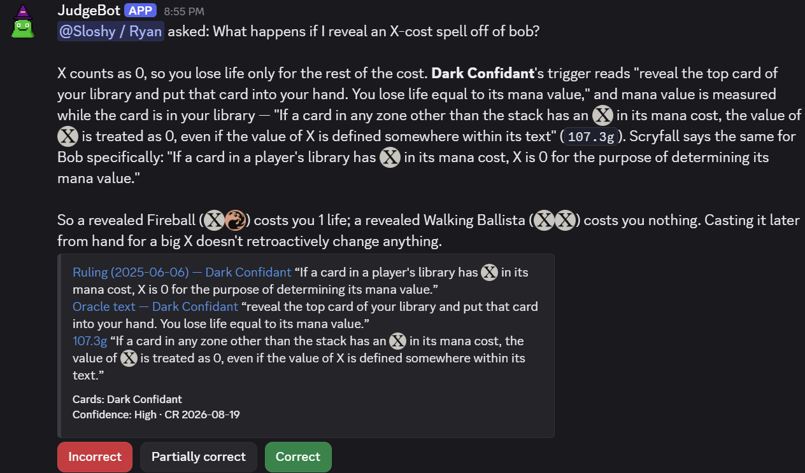

# mtg-judgebot


A Discord bot and anonymous web page that answers Magic: The Gathering rules questions
like a judge. Ask in plain language. Nicknames such as "bob", "goyf" and "snappy" work.
The reply is a concise ruling in which **every claim is backed by a validated, clickable
citation**: a Comprehensive Rules section, an official Scryfall ruling, the card's
current Oracle text, or a prior rated call. On Discord, buttons rate an answer 1–3
(incorrect / partially correct / correct). Ratings decide which past answers later ones
draw on as examples.



The same pipeline behind the web page:

<picture>
  <source media="(prefers-color-scheme: dark)" srcset="site/src/assets/screenshots/web-answer-dark.png">
  
</picture>

More answers, copied verbatim from a published evaluation run, are on the site's
[Sample answers](https://mtg-judgebot.rpeters.dev/start-here/sample-answers/) page.

## Answer pipeline

1. **Extract & classify** (LLM, structured output). The model separates card-name spans
   from rules concepts, picks up to three categories from a fixed taxonomy, and checks
   scope. Tournament-policy and price questions are declined before any money is spent on
   synthesis.
2. **Resolve cards** through a typed ladder: alias table (nicknames, possessives) →
   exact name → old printed names → short names ("Ragavan") → trigram fuzzy. A
   `[[Full Card Name]]` in brackets matches that exact name only. Answers list the cards
   they resolved to. The bot **never guesses**: ambiguity ("Tibalt") becomes a
   "Did you mean…?" button row.
3. **Retrieve** from Postgres through three legs: a curated category→CR-section map,
   full-text search, and pgvector semantic search over rule embeddings. Retrieval adds
   the cards' rulings, glossary entries, hand-written notes for "nightmare" cards
   (Humility, Blood Moon…), and similar prior calls labeled with their community rating.
4. **Synthesize** (LLM). The model writes the ruling from that material and nothing
   else. It may ask for more rules once (the `lookup_rules` tool), and the types enforce
   that limit. Every citation must quote its source verbatim. Invented citations are
   rejected and retried, and an answer with no citations is never shown.
5. **Learn from ratings.** Each call gets a smoothed average score (Bayesian), and a
   rating from a member with the Judge role overrides the crowd's. The score decides
   which prior calls are shown, shown with a warning, or left out. The CR always
   outranks precedent.

## What it takes

A judgebot belongs to the community that runs it, so you run your own: one compose file,
a model API key, and a Discord application you create in a few minutes.

| | |
| --- | --- |
| **Cost per answer** | $0.08–0.25 in model calls on the default setup (Claude Opus for both stages). A `judge.toml` can put a cheaper or a local model on either stage. |
| **Cost per month** | Questions × the above: about $25–75 for ten questions a day. Everything else is free. `JUDGE_MAX_USD` is a hard cap, and `JUDGE_BUDGET_PERIOD=month` makes it a monthly budget. |
| **Accounts** | A model provider (Anthropic out of the box). Optional: Voyage AI for semantic search (a few cents, once), Discord for the bot. |
| **Host** | Anything that runs Docker and stays on: about 200 MB of RAM for the three containers. The image is published for amd64 and arm64, so nothing is compiled. |
| **Setup** | Six commands. The first data load downloads about 110 MB from Scryfall and takes about a minute on a fast connection. |

Nothing in the pipeline needs Discord, so the web page and the command line work before
you have a bot token. The documentation site, <https://mtg-judgebot.rpeters.dev/>,
has the long form of everything below and explains how the judge works inside.

## Running it

You need Docker with the compose plugin, and a model API key.

```sh
git clone https://github.com/sloshy/mtg-judgebot && cd mtg-judgebot
cp .env.example .env               # set ANTHROPIC_API_KEY and JUDGE_OPERATOR_EMAIL (a support address
                                   # the page shows); VOYAGE_API_KEY turns on semantic search
docker compose pull                # the published image, amd64 and arm64
docker compose up -d db            # Postgres with pgvector, on localhost:5432
docker compose run --rm refresh init   # the whole first load: schema, cards, rules, aliases, notes,
                                       # embeddings if keyed. Safe to run again. The nightly
                                       # refresh keeps it current afterwards
docker compose up -d api           # the web page
```

Open <http://localhost:8787> and ask a question. By default the page allows each address
4 questions per 5 minutes (`API_RATE_LIMIT` in `.env`). If port 5432 is taken on your
machine, set `DB_PORT` in `.env` and change `DATABASE_URL` to match.

Every model call is metered against a hard cap, `JUDGE_MAX_USD` (default $5):

- By default the cap is a total for the life of each process. `bot` and `api` have one
  each, and a restart counts from zero.
- `JUDGE_BUDGET_PERIOD=day` or `month` makes it one budget for the period, shared by both
  and kept across restarts.
- Once the budget left is smaller than a call's worst case (about $0.45 for synthesis),
  questions are refused and `JUDGE_ALERT_WEBHOOK` tells you.

`docker compose pull` fetches the image CI built from upstream `main`. To run your own
checkout instead, skip it: `docker compose up -d --build` compiles the image (minutes,
about 4 GB of RAM). [CONTRIBUTING.md](CONTRIBUTING.md) covers working from source with
Rust, where every `docker compose run --rm refresh <command>` is
`cargo run --release -p judge-ingest -- <command>`.

### Your own Discord bot

Every judgebot is its own Discord application, owned by whoever runs it. Create one in
the [Discord Developer Portal](https://discord.com/developers/applications). Discord's
[Building your first Discord Bot](https://docs.discord.com/developers/quick-start/getting-started)
covers the portal. Then:

1. Under **Bot**, reset the token and copy it into `.env` as `DISCORD_TOKEN`. Leave every
   *Privileged Gateway Intent* off. The bot receives only its own slash commands and button
   presses, never messages. Put your own Discord username in `.env` as
   `JUDGE_OPERATOR_DISCORD`. The bot refuses to start without it, and `/help` and
   `/license` show it so that people know who runs the instance.
2. Under **OAuth2 → URL Generator**, tick the scopes `bot` and `applications.commands`
   and leave the permissions at none (replies go through the interaction). Open the
   generated URL to add the bot to your server. You need *Manage Server* there.
3. For instant command registration, put your server's id in `.env` as `GUILD_ID`
   (*User Settings → Advanced → Developer Mode*, then right-click the server → *Copy
   Server ID*). Without it the commands register globally. That can take up to an hour
   to appear but works in every server the bot joins.
4. `docker compose up -d bot`. The log line `registered /judge, /card, /rule, /help,
   /license and /forget` confirms it, and `/help` in the server confirms it end to end.

Members holding the role named by `JUDGE_ROLE` (default `Judge`) rate as judges: their
rating overrides the crowd's. Run `docker compose run --rm refresh emoji` once to upload
the mana symbols as application emoji, so answers show pictures instead of `{W}`. After
code changes, `docker compose up -d --build bot api` redeploys. The documentation site's
[Run your own judgebot](https://mtg-judgebot.rpeters.dev/self-hosting/first-run/)
section has the long form, with links into Discord's documentation.

### Choosing a model

With nothing but `.env`, the judge runs on Anthropic's first-party API: `claude-opus-5`
for both LLM stages, and Voyage `voyage-3.5` for embeddings if `VOYAGE_API_KEY` is set.
The prompts are tuned on that setup, and the [results below](#results) were measured on it.

A `judge.toml` picks something else per stage: Anthropic direct, through a proxy, on
Claude Platform on AWS, Bedrock or Vertex, or any OpenAI-compatible server (OpenAI,
LiteLLM, OpenRouter, vLLM, a local Ollama priced `free`), and Voyage or OpenAI-compatible
embeddings. `judge.example.toml` documents every knob, and
[Model choice](https://mtg-judgebot.rpeters.dev/self-hosting/models/) is the guide.
Under Docker, also set `JUDGE_CONFIG=./judge.toml` in `.env`. The containers see only the
file compose mounts from that path.

### The web page and the HTTP API

`docker compose up -d api` serves an anonymous page on <http://localhost:8787> with the
same pipeline, citations and "did you mean…?" flow, and no rating buttons because nobody
is logged in. With no flags `judge-api` serves the JSON API alone. The flags `--api`, `--web` and
`--mcp` choose the set explicitly. `API_INTERFACES` in `.env` sets the flags the container
passes.
[The web page](https://mtg-judgebot.rpeters.dev/using/web/) and
[The HTTP API](https://mtg-judgebot.rpeters.dev/using/api/) have the details, with a
`curl` example and every reply shape.

### Hosting

The intended deployment is a machine at home behind a [Cloudflare
Tunnel](https://developers.cloudflare.com/cloudflare-one/networks/connectors/cloudflare-tunnel/):
no public IP, no forwarded port, no cloud compute bill. `docs/DEPLOYMENT.md` is the
runbook. It covers tunnel setup, edge rate limiting in front of the anonymous API, and
the weekly R2 backup.

## Evaluation

`eval/gold.yaml` holds 21 adversarially verified questions (layers nightmares,
multi-face cards, errata traps, Commander, out-of-scope) with expected rule ids and
reference answers.

```sh
cargo run -p judge-eval -- recall            # retrieval gate: expected rules present in context? (free)
cargo run -p judge-eval -- answer --label x --limit 21 --max-usd 6   # full live run (~$2.50)
cargo run -p judge-eval -- rescore eval/runs/x.json                  # re-grade a stored run (free)
cargo run -p judge-eval -- show eval/runs/x.json                     # bot vs. gold, side by side
```

Scoring accepts per-question *equivalence lists* of alternate rule ids that state the
same fact, so the metric tracks correctness rather than one author's citation taste.

### Results

Two full runs of the 21 questions, 2026-09-20, CR 2026-08-19, Voyage `voyage-3.5`
embeddings. The run files are committed under `eval/published/` with every question,
answer, citation, time and cost, so none of this has to be taken on trust:
`judge-eval show eval/published/v1-opus-5.json` prints each answer beside its reference.

| | `claude-opus-5`, both stages (the default) | `claude-sonnet-5`, both stages |
| --- | --- | --- |
| Out-of-scope questions declined (of 3) | 3 | 3 |
| In-scope questions answered (of 18) | 17 | 6 |
| …agreeing with the reference ruling | 17 | 5 |
| …partly (right on the main point, a sub-question missed) | 0 | 1 |
| …contradicting the reference | 0 | 0 |
| Asked "did you mean?" instead | 1 | 1 |
| Not answered | 0 | 11 |
| Expected rule ids cited | 45 of 67 (67%) | 12 of 67 (18%) |
| Cost per in-scope question (median) | $0.13 | $0.10 |
| Cost per question *answered* | $0.14 | $0.30 |
| Time per in-scope question (median / longest) | 22 s / 43 s | 26 s / 589 s |
| Whole run | $2.39 | $1.83 |

What these measure, and what they do not:

- **Answered** means a verdict that passed validation: every citation names a source the
  model was shown and quotes it verbatim, and every rule number in the text is one of
  those citations. "Not answered" means the pipeline refused to show an answer, not that
  it showed a wrong one. Sonnet's eleven were:
  - five answers with no citations or no text
  - four errors in the tool round (a second `lookup_rules` request, a malformed rule id,
    a request the API refused)
  - one bad quote
  - one answer naming rules it did not cite
- **"Did you mean?"** is the pipeline working as designed, but it leaves an eval question
  unanswered. On Opus the extractor passed `[[bob]]` through in brackets, and a bracketed
  name only ever matches exactly. On Sonnet it offered "Bruna" and "Gisela" as written, each of
  which is several cards.
- **Agreement with the reference** was judged by Claude reading each answer against the
  gold set's reference answer under a strict rubric. The references were written and
  checked by models, then audited against Oracle text, rulings and CR text (which found
  three to correct). No human judge has reviewed either side, so read this column as "no
  contradiction found", not as a measured accuracy.
- **Expected rule ids cited** tracks how closely the citations match the gold set's
  lists, which include background rules a good answer may leave out. It is a floor on
  citation overlap and a regression signal between runs, not an accuracy score.
- Twenty-one questions chosen to be hard is a small, adversarial sample. It shows the
  pipeline holds up on layers, multi-faced cards, old wordings and Commander. It does not
  say how often an answer in your server will be right.
- **The Sonnet dollars err high.** That run's configuration
  (`eval/published/v1-sonnet-5.judge.toml`) prices input and output at list and leaves
  cache reads at the input price, which is how an unlisted price defaults. The counts of
  questions answered do not depend on it.

The prompts are tuned on the default. The second column shows what that costs a smaller
model. Sonnet 5 runs at 40% of the token price, but fails validation or the tool round on
most hard questions and still pays for the retries. On this evidence there is no cheaper
configuration to recommend. The documentation site's Model choice page covers what does
save money.

## Design

Rust was chosen for compiler-enforced correctness. `docs/DECISIONS.md` records that
decision and the other main design decisions, with the alternatives rejected. In practice:

- Closed enums for every domain sum, and refined newtypes for ids.
- `Verdict<Unvalidated> → validate() → Verdict<Validated>`, so an unchecked answer
  *cannot* be persisted or shown.
- A typestate on the synthesis loop, so the tool round cannot repeat.
- Compile-time-checked SQL (sqlx + committed offline data).
- An LLM output schema derived from the same structs the responses parse into.

`docs/ARCHITECTURE.md` is the living design document.

```
crates/
  core       domain types, ports, judge() pipeline, citation validation — no I/O
  llm        provider-neutral chat types, Backend + sealed ChatModel port, spend cap, retry loop, Synth typestate
  anthropic  the Messages API as a judge-llm backend: wire types, schema transform, endpoints
  openai     OpenAI-compatible chat completions as a judge-llm backend: strict-schema transform, dialect knobs
  embed      Voyage and OpenAI-compatible embeddings, each tagged with its vector Space
  bot        Postgres adapters (resolver / retriever / call store), judge.toml loader, prompts, Discord (serenity/poise)
  ingest     Scryfall + Comprehensive Rules loaders, embedder  (bin)
  eval       gold-set harness: recall / answer / rescore / show (bin)
  api        anonymous HTTP adapter (axum); the web page and the /mcp transport are opt-in flags (bin)
  agent      the judge for other agents: sessions, lookups and the pipeline as judge-cli and judge-mcp
web/         SolidJS + TypeScript single page (Vite)
site/        the documentation site (Astro + Starlight); docs/ is its source
data/        categories.yaml (generates the Category enum), aliases.yaml, notes.yaml
eval/        gold.yaml, published/ (graded runs), runs/ (yours, gitignored)
docs/        EXPLAINER.md (the tour), ARCHITECTURE.md (the reference), DECISIONS.md (why),
             PROVIDERS.md (the model-provider reference), DEPLOYMENT.md (the runbook)
```

Each community runs its own judgebot. One process is one spend cap, one judge role and one
Discord application, by design rather than omission (`docs/DECISIONS.md` D16). Not built:
tournament-policy (MTR/IPG) coverage. The bot declines those questions rather than
winging them.

## License and attribution

AGPL-3.0-or-later. See [LICENSE](LICENSE). Running a modified version of this bot
(Discord, the HTTP API or MCP) as a network service requires making the modified source
available to its users. The bot does that for you. Every remote interface states the
licence and copyright and names the repository its source is in, with the commit the
binary was built from:

- the web page's footer and `GET /api/about`
- Discord's `/help` and `/license`
- the MCP server's initialization instructions and its `about` tool
- `judge-cli about`

CI stamps the commit into the published image, and `git rev-parse HEAD` stamps it into a
local build. If you change anything, set `JUDGE_SOURCE_URL` in `.env` to the repository
holding your changes and every interface points there. That is the whole of your
obligation under section 13.

The same interfaces name whoever runs the instance. The bot requires
`JUDGE_OPERATOR_DISCORD` (a Discord username) and `judge-api` requires
`JUDGE_OPERATOR_EMAIL` (a support address). Each shows the other contact too when it is
set. `judge-cli` and `judge-mcp` on stdio need neither.

This is unofficial Fan Content permitted under Wizards of the Coast's [Fan Content
Policy](https://company.wizards.com/en/legal/fancontentpolicy), not approved or
endorsed by Wizards. Magic: The Gathering, the Comprehensive Rules, card text and
rulings are © Wizards of the Coast. Card data and rulings come from
[Scryfall](https://scryfall.com) under its [data guidelines](https://scryfall.com/docs/api).
An instance downloads both when it loads its data (`judge-ingest`), and the repository carries only a short CR excerpt as
a parser test fixture. Rule links go to the independent
[Yawgatog](https://yawgatog.com/resources/magic-rules/) CR mirror. `NOTICE` has the
full statement. The web page and every page of the documentation site repeat this
disclaimer and the data sources in their footers, and the bot's `/help` gives a short
form of it.
