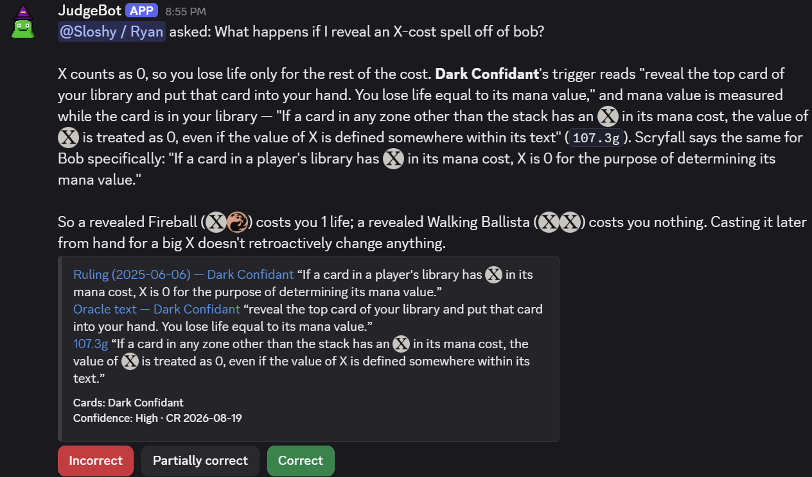

# mtg-judgebot


A Discord bot and web app that answers Magic: The Gathering rules questions like a judge.
Ask in plain language. Nicknames such as "bob", "goyf" and "snappy" work. Every claim in
the answer is **backed by a checked, clickable citation**: a Comprehensive Rules section,
an official Scryfall ruling, the card's current Oracle text, or a past answer. On Discord,
members rate answers as correct, partially correct or incorrect, and ratings decide which
past answers new ones draw on as examples.



The same answer in the web app:

<picture>
  <source media="(prefers-color-scheme: dark)" srcset="site/src/assets/screenshots/web-answer-dark.png">
  
</picture>

More answers, copied verbatim from a published evaluation run, are on the
[Sample answers](https://mtg-judgebot.rpeters.dev/start-here/sample-answers/) page.

## How it answers

1. **Read the question.** One model call picks out card names and rules concepts and
   sorts the question into up to three categories. Tournament-policy and price questions
   are declined here, before the expensive step.
2. **Find the cards.** Nicknames and possessives, exact names, old printed names, short
   names ("Ragavan"), then fuzzy matching. `[[Full Card Name]]` in brackets matches that
   exact name (or a listed nickname) only. Answers show which cards they used. The bot
   **never guesses**: an ambiguous name ("Tibalt") gets a "Did you mean…?" prompt.
3. **Gather the material.** The rules sections for the question's categories, plus
   full-text and semantic search over the Comprehensive Rules. Then the cards' rulings,
   glossary entries, hand-written notes for notoriously tricky cards (Humility, Blood
   Moon…), and similar past answers with their ratings.
4. **Write the ruling.** The model answers from that material and nothing else, and may
   ask for more rules once. Every citation must quote its source word for word, and every
   rule number in the text must be cited. An answer that fails the check is sent back once
   with a note on what failed. One that fails again is never shown.
5. **Learn from ratings.** Ratings decide which past answers the model sees as examples.
   A member with the Judge role outranks the crowd, and the rules always outrank past
   answers.

## What it takes

Each community runs its own judgebot: one compose file, a model API key, and a Discord
application you create in a few minutes.

| | |
| --- | --- |
| **Cost per answer** | $0.07–0.15 on the default model (Claude Opus 5.5). A `judge.toml` can switch to a cheaper or a local model. |
| **Cost per month** | About $20–45 for ten questions a day. Nothing else costs money. `JUDGE_MAX_USD` is a hard cap, and `JUDGE_BUDGET_PERIOD=month` makes it a monthly budget. |
| **Accounts** | A model provider (Anthropic by default). Optional: Voyage AI for semantic search (a few cents, once), and Discord for the bot. |
| **Host** | Any machine that runs Docker and stays on, with about 200 MB of RAM to spare. Images are published for amd64 and arm64, so nothing is compiled. |
| **Setup** | Six commands. The first data load downloads about 110 MB from Scryfall and takes about a minute on a fast connection. |

You don't need Discord to start: the web app and the command line work without a bot
token. The documentation site, <https://mtg-judgebot.rpeters.dev/>, has the long form of
everything below and explains how the judge works.

## Running it

You need Docker with the compose plugin, and a model API key.

```sh
git clone https://github.com/sloshy/mtg-judgebot && cd mtg-judgebot
docker compose pull                # the published image, amd64 and arm64
scripts/config.sh                  # the config editor: open the URL it prints, set ANTHROPIC_API_KEY,
                                   # JUDGE_OPERATOR_EMAIL (a support address the app shows) and
                                   # JUDGE_ROLES to '--api --web --jobs' (no Discord yet), save, Ctrl-C.
                                   # VOYAGE_API_KEY turns on semantic search
docker compose up -d db            # Postgres with pgvector, on localhost:5432
docker compose run --rm refresh init   # the first data load: schema, cards, rules, nicknames, notes and
                                       # embeddings if keyed. Safe to rerun. judgebot refreshes the data
                                       # daily after that (JUDGE_REFRESH_HOURS)
docker compose up -d               # judgebot: the web app and the daily refresh
```

Open <http://localhost:8787> and ask a question. Each address can ask 4 questions per 5
minutes by default (`API_RATE_LIMIT`). If port 5432 is taken, set `DB_PORT` and change
`DATABASE_URL` to match.

The config editor checks every change the same way the bot does at startup, and tells you
what would fail and why. To edit by hand instead, `cp .env.example .env` and fill it in.
Every variable is documented in the file.

Every model call, embeddings included, counts against a hard cap, `JUDGE_MAX_USD`
(default $5):

- By default the cap covers the process's lifetime and resets on restart.
- `JUDGE_BUDGET_PERIOD=day` or `month` makes it a daily or monthly budget that survives
  restarts.
- When what's left can't cover a call's worst case (about $0.36 for the answering step), questions
  are refused and `JUDGE_ALERT_WEBHOOK` is notified.

`docker compose pull` fetches the image CI builds from upstream `main`. To run your own
checkout instead, skip it and run `docker compose up -d --build` (takes minutes and about
4 GB of RAM). [CONTRIBUTING.md](CONTRIBUTING.md) covers working from source with Rust,
where `docker compose run --rm refresh <command>` becomes
`cargo run --release -p judgebot -- ingest <command>`.

### Your own Discord bot

Every judgebot is its own Discord application, owned by whoever runs it. Create one in
the [Discord Developer Portal](https://discord.com/developers/applications) (Discord's
[Building your first Discord Bot](https://docs.discord.com/developers/quick-start/getting-started)
walks through the portal). Then:

1. Under **Bot**, reset the token and put it in `.env` as `DISCORD_TOKEN`. Leave every
   *Privileged Gateway Intent* off: the bot only receives its own slash commands and
   button clicks, never messages. Put your own Discord username in `.env` as
   `JUDGE_OPERATOR_DISCORD`. The bot won't start without it, and `/help` and `/license`
   show it so people know who runs the bot.
2. Under **OAuth2 → URL Generator**, tick the scopes `bot` and `applications.commands`
   and leave the permissions empty. Open the generated URL to add the bot to your server
   (you need *Manage Server* there).
3. For commands that appear immediately, put your server's id in `.env` as `GUILD_ID`
   (*User Settings → Advanced → Developer Mode*, then right-click the server → *Copy
   Server ID*). The commands then work only in that server. Without it they register
   everywhere, which can take up to an hour, and work in every server the bot joins and
   in DMs (all but `/judge`).
4. Clear `JUDGE_ROLES` (unset, it runs the bot, the web app and the refresh) and run
   `docker compose up -d`. The log line `registered /judge, /card, /rule, /help,
   /license and /forget` means it worked. Try `/help` in your server.

Members with the role named by `JUDGE_ROLE` (default `Judge`) rate as judges, and their
rating overrides everyone else's. Run `docker compose run --rm refresh emoji` once to
upload the mana symbols, so answers show pictures instead of `{W}`. After code changes,
`docker compose up -d --build judgebot` redeploys.
[Run your own judgebot](https://mtg-judgebot.rpeters.dev/self-hosting/first-run/) has the
long form.

### Choosing a model

With only `.env`, the judge uses Anthropic's API with `claude-opus-5-5` for both
steps, and Voyage `voyage-3.5` for semantic search if `VOYAGE_API_KEY` is set. The
[results below](#results) were measured on that setup.

A `judge.toml` can pick a different model for each step: Anthropic directly, through a
proxy, on Claude Platform on AWS, Bedrock or Vertex, or any OpenAI-compatible server
(OpenAI, LiteLLM, OpenRouter, vLLM, a local Ollama priced `free`). Embeddings can come from Voyage or an
OpenAI-compatible server. `judge.example.toml` documents every option, and
[Model choice](https://mtg-judgebot.rpeters.dev/self-hosting/models/) is the guide. Under
Docker, also set `JUDGE_CONFIG=./judge.toml` in `.env`.

The config editor (`scripts/config.sh`) edits both files from a local page. It never
shows a saved secret, only lets you replace it.
[The config editor](https://mtg-judgebot.rpeters.dev/self-hosting/config-editor/) has the
details.

### Web app and HTTP API

The web app at <http://localhost:8787> uses the same pipeline, citations and "did you
mean…?" prompts as the bot. It has no rating buttons, since nobody logs in. What a
judgebot runs is set by roles: `--discord`, `--api` (the JSON API), `--web` (the web
app), `--mcp` (for AI agents) and `--jobs` (the data refresh). `JUDGE_ROLES` in `.env`
lists them, and unset it is `--discord --api --web --jobs`.
[The web app](https://mtg-judgebot.rpeters.dev/using/web/) and
[The HTTP API](https://mtg-judgebot.rpeters.dev/using/api/) have the details.

### Hosting

The intended setup is a machine at home behind a [Cloudflare
Tunnel](https://developers.cloudflare.com/cloudflare-one/networks/connectors/cloudflare-tunnel/):
no public IP, no open ports, no cloud bill. `docs/DEPLOYMENT.md` is the runbook. It
covers the tunnel, rate limiting at Cloudflare, and weekly backups to R2.

## Evaluation

`eval/gold.yaml` holds 22 questions chosen to be hard (layers, multi-faced cards, errata traps,
Commander, out-of-scope questions, and one ruling corrected after a wrong answer was
reported) with the rules a correct answer cites and a reference answer. All but the
corrected one were checked adversarially.

```sh
cargo run -p judge-eval -- recall            # are the expected rules in the material? (free)
cargo run -p judge-eval -- answer --label x --limit 22 --max-usd 6   # full live run (~$1.70)
cargo run -p judge-eval -- grade eval/runs/x.json                    # a model grades each answer (~$0.40)
cargo run -p judge-eval -- rescore eval/runs/x.json                  # re-score a stored run (free)
cargo run -p judge-eval -- show eval/runs/x.json                     # bot vs. reference, side by side
```

Each question can list alternate rule ids that state the same fact, so the score tracks
whether the answer is right, not whether it picked one author's preferred citation.
`grade` asks a model whether each ruling follows from its quotes and agrees with the
reference, the same reading the Results table was graded with by hand
(`docs/DECISIONS.md` D28). It is a score, not a pass/fail gate.

### Results

Three full runs of the 21 questions the set held then, on CR 2026-08-19 with Voyage `voyage-3.5`
embeddings: Opus and Sonnet on 2026-09-29, Haiku on 2026-10-07 on the same pipeline. The
run files are in `eval/published/` with every question, answer, citation, time and cost.
`judge-eval show eval/published/v1-opus-5-5.json` prints each answer beside its reference.

| | `claude-opus-5-5`, both stages, synthesis at medium effort (the default) | `claude-sonnet-5-5`, both stages, synthesis at high effort | `claude-haiku-5-5`, both stages, synthesis at medium effort |
| --- | --- | --- | --- |
| Out-of-scope questions declined (of 3) | 3 | 3 | 3 |
| In-scope questions answered (of 18) | 18 | 17 | 16 |
| …agreeing with the reference ruling | 18 | 17 | 14 |
| …partly (right on the main point, a sub-question missed) | 0 | 0 | 2 |
| …contradicting the reference | 0 | 0 | 0 |
| Asked "did you mean?" instead | 0 | 1 | 2 |
| Not answered | 0 | 0 | 0 |
| …following from what they cite alone | 14 | 13 | 10 |
| Decisive rule ids cited | 31 of 35 (89%) | 29 of 35 (83%) | 24 of 35 (69%) |
| Supporting rule ids also cited | 16 of 32 | 12 of 32 | 10 of 32 |
| Cost per in-scope question (median) | $0.09 | $0.05 | $0.003 |
| Cost per question *answered* | $0.09 | $0.06 | $0.003 |
| Time per in-scope question (median / longest) | 15 s / 27 s | 11 s / 32 s | 13 s / 26 s |
| Whole run | $1.62 | $0.98 | $0.05 |

How to read the table:

- **Answered** means the answer passed validation: every citation points to material the
  model was shown and quotes it word for word, and every rule number in the text is
  cited. "Not answered" means the bot refused to show an answer, not that it showed a
  wrong one. A rejected answer gets one retry with a note on what failed. Sonnet needed
  five retries in this run, Haiku three, Opus one, and every retry succeeded.
- **"Did you mean?"** is the bot working as designed when a name could mean several
  cards, but it leaves the question unanswered. Sonnet asked once, about "Bruna" and
  "Gisela": it doesn't always expand shortened names (about half the time over several
  runs), where Opus names the melded pair. Haiku asked about the same pair, and once
  about "Glimmerpuff", a card name it made up for a question about Clone and Tarmogoyf.
- **Agreement with the reference** was judged by Claude, reading each answer against the
  reference under a strict rubric. The references were written and checked by models,
  then audited against Oracle text, rulings and the rules, which found three to correct.
  No human judge has reviewed either side, so read this as "no contradiction found", not
  as measured accuracy. It grades the ruling, not every side remark. The Opus run had no
  wrong side remarks. The Sonnet run had one (it said Urborg under Blood Moon has no
  abilities, when Blood Moon gives it "{T}: Add {R}"), which didn't change the ruling.
  The Haiku run had two: that an opponent gets priority only once all players pass, and
  a ruling on Urborg's page credited to Magus of the Moon.
- **Following from what they cite** asks whether the ruling follows from the quoted text
  alone. The rest rely on a step they don't cite: Doubling Season's own text for the
  counter math, the definition of "dies" (700.4), or the rule that Oracle text overrides
  an old printing (108.1). Graders apply this one less evenly than agreement, so a
  difference of one or two between runs means little.
- **Decisive rule ids** are the rules a reference answer rests on, which a correct answer
  should cite. **Supporting** ids are background a good answer may leave out, so missing
  one doesn't count against it. The split was drafted by a model and accepted by the
  maintainer, not a judge. It signals regressions between runs rather than measuring
  accuracy: Opus's Blood Moon answer misses 305.7, the rule it rests on, but cites Blood
  Moon's own ruling, which says the same thing.
- Twenty-one hard questions is a small sample. It shows the bot holds up on layers,
  multi-faced cards, old wordings and Commander. It doesn't tell you how often an answer
  in your server will be right.
- **The dollar figures are list prices** as the spend cap counts them, from the built-in
  price table. Your provider's console has the real bill.

Opus 5.5 answers at medium effort, Anthropic's default for it. At high effort it did
equally well on the set, with no more of its rulings following from what it cited, for a
few cents more per run. That high run predates the change that prints CR examples under
their own rule, and each setting was run once, so read that as "no worse", not as a
measured gain.

Sonnet is the budget option, at half of Opus 5.5's price per token
(`eval/published/v1-sonnet-5-5.judge.toml`). It stays at high effort: at medium it
misdescribed a card once and made three wrong side remarks, which the 15% saved doesn't
justify. At high, every answer it gave agreed with the reference, at about 60% of the
cost per answer and slightly faster. It needed more retries, asked "did you mean?" once
where Opus answered, and cited fewer background rules.

Haiku is the cheapest model, at a twentieth of Sonnet's price per token
(`eval/published/v1-haiku-5-5.judge.toml`). A whole run cost five cents. No answer
contradicted the reference, but two answered only part of the question: it noted that
Questing Beast has no trample without working through the trample-and-deathtouch case
the asker described, and it wouldn't name "Tim" (Prodigal Sorcerer). Fewer of its rulings
follow from what they cite, usually because it uses a card's text without quoting it.
It answers at medium effort, Anthropic's default for it: high and low agreed with the
reference no more often and made more wrong side remarks (one run each). Sonnet stays the recommended budget option. Haiku suits a
community where the bill matters more than an occasional partial answer. The
documentation site's Model choice page covers switching and other ways to save money.

## Design

Rust was chosen so the compiler enforces correctness. `docs/DECISIONS.md` records that
choice and the other main design decisions, with the alternatives rejected. In practice:

- Closed enums wherever a value has a fixed set of cases, and validated newtypes for ids.
- `Verdict<Unvalidated> → validate() → Verdict<Validated>`, so an unchecked answer
  *cannot* be stored or shown.
- A typestate on the answer loop, so the extra-rules lookup cannot repeat.
- SQL checked at compile time (sqlx + committed offline data).
- The model's output schema is generated from the same structs its responses parse into.

`docs/ARCHITECTURE.md` is the full design reference.

```
crates/
  core       domain types, ports, judge() pipeline, citation validation — no I/O
  llm        provider-neutral chat types, Backend + sealed ChatModel port, spend cap, retry loop, Synth typestate
  anthropic  the Messages API as a judge-llm backend: wire types, schema transform, endpoints
  openai     OpenAI-compatible chat completions as a judge-llm backend: strict-schema transform, dialect knobs
  embed      Voyage and OpenAI-compatible embeddings, each tagged with its vector Space
  bot        Postgres adapters (resolver / retriever / call store), the Scryfall + Comprehensive Rules loaders
             and embedder, the refresh schedule, judge.toml loader, prompts, Discord (serenity/poise)
  api        HTTP adapter (axum): the JSON API, the web app and the /mcp transport
  judgebot   the one long-running binary: --discord --api --web --mcp --jobs as launch-time roles, and
             `judgebot ingest` (init, refresh, cards, rules, embed, …) over the loaders (bin)
  eval       gold-set harness: recall / answer / grade / rescore / show (bin)
  agent      the judge for other agents: sessions, lookups and the pipeline as judge-cli and judge-mcp
  configure  judge-config: a localhost page editing judge.toml and .env, checked by the loaders (bin)
web/         SolidJS + TypeScript web app (Vite)
site/        the documentation site (Astro + Starlight); docs/ is its source
data/        categories.yaml (generates the Category enum), aliases.yaml, notes.yaml
eval/        gold.yaml, published/ (graded runs), runs/ (yours, gitignored)
docs/        EXPLAINER.md (the tour), ARCHITECTURE.md (the reference), DECISIONS.md (why),
             PROVIDERS.md (the model-provider reference), DEPLOYMENT.md (the runbook)
```

One process is one spend cap, one judge role and one Discord application, by design
(`docs/DECISIONS.md` D16). Tournament policy (MTR/IPG) is not covered: the bot declines
those questions rather than guessing.

## License and attribution

AGPL-3.0-or-later. See [LICENSE](LICENSE). If you run a modified version as a network
service (Discord, the HTTP API or MCP), you must make your modified source available to
its users. The bot does this for you: every remote interface shows the licence, the
copyright, the source repository and the commit it was built from:

- the web app's footer and `GET /api/about`
- Discord's `/help` and `/license`
- the MCP server's instructions and its `about` tool
- `judge-cli about`

CI stamps the commit into the published image, and `git rev-parse HEAD` stamps it into a
local build. If you change anything, set `JUDGE_SOURCE_URL` in `.env` to the repository
with your changes, and every interface points there. That covers your obligation under
section 13.

The same interfaces show who runs the instance. The bot requires
`JUDGE_OPERATOR_DISCORD` (a Discord username) and the web app, API and MCP require
`JUDGE_OPERATOR_EMAIL` (a support address). Each shows the other contact too when it is
set. `judge-cli` and `judge-mcp` on stdio need neither.

This is unofficial Fan Content permitted under Wizards of the Coast's [Fan Content
Policy](https://company.wizards.com/en/legal/fancontentpolicy), not approved or
endorsed by Wizards. Magic: The Gathering, the Comprehensive Rules, card text and
rulings are © Wizards of the Coast. Card data and rulings come from
[Scryfall](https://scryfall.com) under its [data guidelines](https://scryfall.com/docs/api).
An instance downloads both when it loads its data (`judgebot ingest`). The repository
carries only a short excerpt of the rules as a test fixture. Rule links go to the
independent [Yawgatog](https://yawgatog.com/resources/magic-rules/) rules mirror.
`NOTICE` has the full statement. The web app and every page of the documentation site
repeat this notice in their footers, and the bot's `/help` gives a short form of it.
