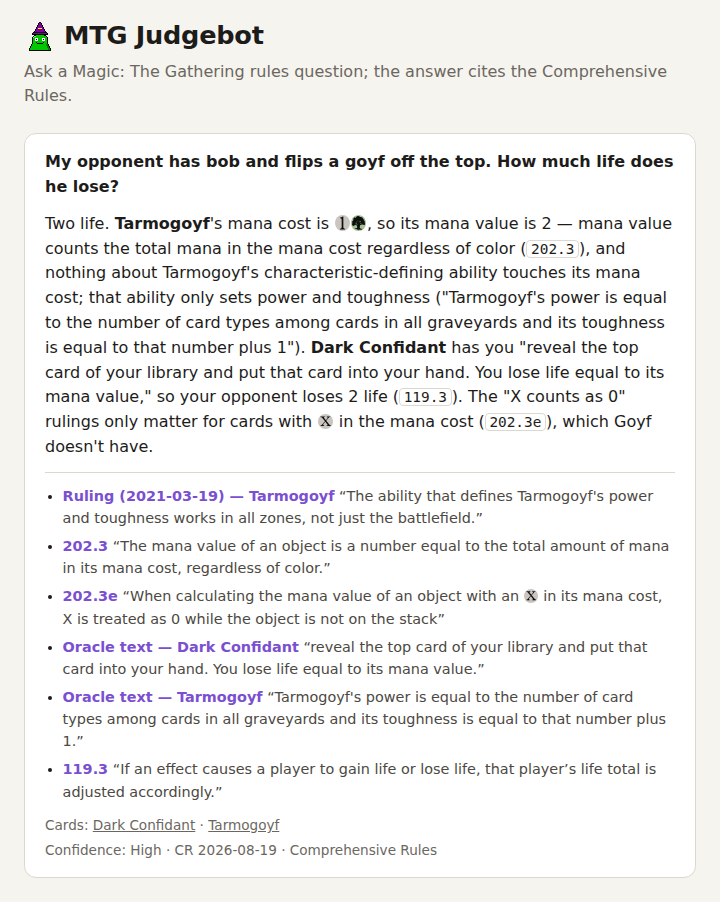
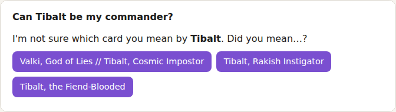
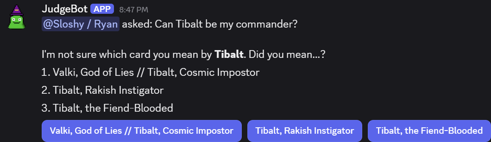

The following are sample answers given by the bot so you can see how it works without running it yourself.

A nickname that could mean several cards gets a question back instead of a guess:

On Discord the answer arrives as a message, with the citations in an embed and the rating
buttons beneath it. The "did you mean…?" choices are buttons too.

## Where these come from

The five answers below are copied from `eval/published/v1-opus-5.json`, the 2026-09-20
run of the [gold evaluation set](../../how-it-works/evaluation/) on the default
configuration (`claude-opus-5` on both stages, Voyage embeddings). Nothing is edited, bar the one note on the last sample:
the question is as the gold set asks it, typos and all, and the answer, the citations,
the time and the cost are as the run recorded them. The run file cuts a long quote at
a display limit, which is the "…" at the end of a few below; the full span was what
validation checked. Every quote was checked verbatim
against its source before the answer was accepted. Rule numbers link to the Yawgatog
mirror, as they do in a real answer. The run file holds all 21, including the one where
the pipeline asked which card was meant instead of answering.

## Layers: Humility and Opalescence

**Asked**

> ok classic one. I have [[Humility]] out and my opponent drops [[Opalescence]]. what are Humility and Opalescence now?? are all my creatures still 1/1? does the answer change if Opalescence was out first?

**Answered**

> With **Humility** already out and **Opalescence** arriving later, Opalescence wins layer 7b.
>
> Layer 4: Opalescence's "Each other non-Aura enchantment is a creature in addition to its other types" animates Humility (and your other non-Aura enchantments); Opalescence does *not* animate itself, so it stays a noncreature enchantment with no P/T and keeps its abilities.
>
> Layer 6: Humility's "All creatures lose all abilities" strips abilities from every creature, including now-creature Humility — but its own continuous effect keeps applying anyway, per `613.6` ("even if the ability generating the effect is removed during this process").
>
> Layer 7b: both setting effects live here, so timestamp order decides (`613.4b`, `613.7`). Humility is older, so 1/1 applies first and Opalescence's "base power and base toughness each equal to its mana value" overwrites it. Humility ends up a 4/4 ability-less enchantment creature, and any other non-Aura enchantment is a creature with P/T equal to its mana value. Your ordinary creatures are untouched by Opalescence, so they're still 1/1 with no abilities.
>
> If Opalescence was on the battlefield first, the layers are identical but 7b flips: Opalescence sets mana-value P/T, then Humility overwrites it — everything, including Humility and the animated enchantments, is 1/1 with no abilities.

- [**613.6**](https://yawgatog.com/resources/magic-rules/#R6136) “If an effect starts to apply in one layer and/or sublayer, it will continue to be applied to the same set of objects in each other applicable layer and/or sublayer, even if the ability generating the …”
- [**613.4b**](https://yawgatog.com/resources/magic-rules/#R6134b) “Layer 7b: Effects that set power and/or toughness to a specific number or value are applied.”
- [**613.7**](https://yawgatog.com/resources/magic-rules/#R6137) “An effect with an earlier timestamp is applied before an effect with a later timestamp.”
- **Oracle text — Humility** “All creatures lose all abilities and have base power and toughness 1/1.”
- **Oracle text — Opalescence** “Each other non-Aura enchantment is a creature in addition to its other types and has base power and base toughness each equal to its mana value.”
- **Ruling — Opalescence** “But if Humility entered before Opalescence, the following is true: Layer 4: Humility and Worship each become creatures that are still enchantments (Opalescence). Layer 6: Humility and Worship each los…”
- **Ruling — Opalescence** “Does not animate itself.”

Confidence: High · CR 2026-08-19 · 33 s · 2 model calls · $0.15

## Trample and deathtouch, and a misremembered card

**Asked**

> I attack with a 5/5 trample that also has deathtouch (Questing Beast) and they block with a 4/4. how much can I trample over? my opponent says I have to assign 4 to the blocker first

**Answered**

> First, a correction: **Questing Beast** has no trample. Its Oracle text reads "Vigilance, deathtouch, haste" — nothing tramples over. Blocked by the 4/4, it must assign all of its combat damage to that blocker, and none reaches the player (`510.1c`: "If exactly one creature is blocking it, it assigns all its combat damage to that creature").
>
> If you do give it trample from somewhere, your opponent is wrong: you assign only 1 to the blocker and the rest to the player. Trample requires lethal damage on blockers before excess goes through (`702.19b`), and with deathtouch any nonzero combat damage assigned counts as lethal for that check (`702.2c`). So a trampling 5/5 deathtoucher assigns 1 to the 4/4 and 4 to the defending player.

- **Oracle text — Questing Beast** “Vigilance, deathtouch, haste”
- [**510.1c**](https://yawgatog.com/resources/magic-rules/#R5101c) “If exactly one creature is blocking it, it assigns all its combat damage to that creature.”
- [**702.19b**](https://yawgatog.com/resources/magic-rules/#R70219b) “The controller of an attacking creature with trample first assigns damage to the creature(s) blocking it. Once all those blocking creatures are assigned lethal damage, any excess damage is assigned as…”
- [**702.2c**](https://yawgatog.com/resources/magic-rules/#R7022c) “Any nonzero amount of combat damage assigned to a creature by a source with deathtouch is considered to be lethal damage for the purposes of determining if excess damage is being dealt.”

Confidence: High · CR 2026-08-19 · 25 s · 3 model calls · $0.13

## An old printing against the current Oracle text

**Asked**

> old school question. my Waylay (Urza's Saga printing) says 'at end of turn, remove them from the game'. so I cast it during my opponent's end step, the knights survive since the end step already started, and I get to swing with them on my turn right? classic waylay trick

**Answered**

> No — that trick is dead. **Waylay** has been errata'd; its current Oracle text reads "Create three 2/2 white Knight creature tokens. Exile them at the beginning of the next cleanup step."
>
> Resolving it creates a delayed triggered ability (`603.7`) waiting for the next cleanup step — and that's the very next step of the same turn, since "The ending phase consists of two steps: end and cleanup" (`512.1`). When that cleanup step begins, the game checks whether "any triggered abilities are waiting to be put onto the stack (including those that trigger “at the beginning of the next cleanup step”)"; the trigger goes on the stack, players get priority, it resolves, the Knights are exiled, and then another cleanup step begins (`514.3a`).
>
> So the Knights stick around only for the rest of your opponent's end step — fine as surprise blockers earlier in combat or as sacrifice fodder — but they never reach your turn.

- **Oracle text — Waylay** “Create three 2/2 white Knight creature tokens. Exile them at the beginning of the next cleanup step.”
- [**603.7**](https://yawgatog.com/resources/magic-rules/#R6037) “An effect may create a delayed triggered ability that can do something at a later time.”
- [**512.1**](https://yawgatog.com/resources/magic-rules/#R5121) “The ending phase consists of two steps: end and cleanup.”
- [**514.3a**](https://yawgatog.com/resources/magic-rules/#R5143a) “the game checks to see if any state-based actions would be performed and/or any triggered abilities are waiting to be put onto the stack (including those that trigger “at the beginning of the next cle…”

Confidence: High · CR 2026-08-19 · 17 s · 3 model calls · $0.13

## Commander: colour identity and the command zone

**Asked**

> commander q: my commander is [[Kenrith, the Returned King]]. two things: 1) can I run Nicol Bolas, the Ravager since Kenrith's text mentions all 5 colors? and 2) someone bounced Kenrith to my hand with Unsummon - does he go to the command zone or is that only for graveyard/exile?

**Answered**

> Both yes.
>
> 1) **Kenrith, the Returned King**'s color identity is all five colors. Color identity is "the color or colors of any mana symbols in that card's mana cost or rules text" (`903.4`), and Kenrith's rules text contains `{R}`, `{1}{G}`, `{2}{W}`, `{3}{U}` and `{4}{B}` on top of his {4}{W} cost. Since **Nicol Bolas, the Ravager // Nicol Bolas, the Arisen** is blue/black/red on both faces (the back face counts too, per `903.4d`), every color in its identity is in Kenrith's, so it's legal per `903.5c`. With a WUBRG commander you can run any card that's otherwise legal.
>
> 2) He can go to the command zone. `903.9a` (graveyard/exile) is the state-based-action version, but `903.9b` covers hand and library: "If a commander would be put into its owner's hand or library from anywhere, its owner may put it into the command zone instead." That's a replacement effect, so you choose as **Unsummon** resolves — if you let him land in your hand, he stays there.

- **Ruling — Kenrith, the Returned King** “Kenrith's first ability affects only creatures on the battlefield at the time it resolves.”
- **Oracle text — Kenrith, the Returned King** “{4}{B}: Put target creature card from a graveyard onto the battlefield under its owner's control.”
- [**903.4**](https://yawgatog.com/resources/magic-rules/#R9034) “The color identity of a card is the color or colors of any mana symbols in that card’s mana cost or rules text”
- [**903.4d**](https://yawgatog.com/resources/magic-rules/#R9034d) “The back face of a double-faced card (see rule 712) is included when determining a card’s color identity.”
- [**903.5c**](https://yawgatog.com/resources/magic-rules/#R9035c) “A card can be included in a Commander deck only if every color in its color identity is also found in the color identity of the deck’s commander.”
- [**903.9b**](https://yawgatog.com/resources/magic-rules/#R9039b) “If a commander would be put into its owner’s hand or library from anywhere, its owner may put it into the command zone instead.”
- [**903.9a**](https://yawgatog.com/resources/magic-rules/#R9039a) “If a commander is in a graveyard or in exile and that object was put into that zone since the last time state-based actions were checked, its owner may put it into the command zone.”

Confidence: High · CR 2026-08-19 · 22 s · 2 model calls · $0.13

## Out of scope: a price question

**Asked**

> how much is a snappy going for these days? thinking about picking up a playset

**Answered**

> I only answer Comprehensive Rules and Commander rules questions. Tournament policy (MTR/IPG) and questions that aren't about the rules are out of my scope: for policy, see the Magic Tournament Rules or ask a tournament judge.

(The run file records this outcome as `OutOfScope`. The sentence above is what Discord
and the web page show for it.)

Declined after the classification call, before synthesis · 3 s · 1 model call · $0.005
