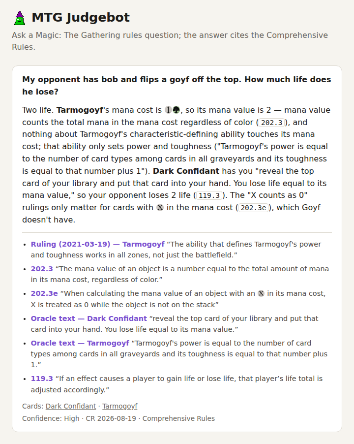
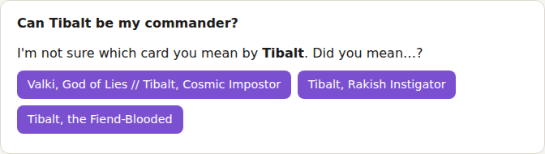
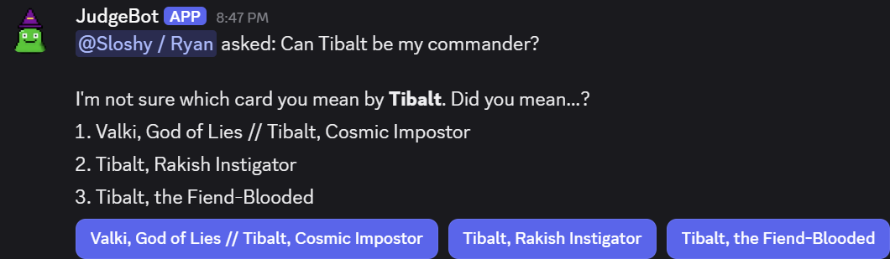

The following are sample answers given by the bot so you can see how it works without running it yourself.

A nickname that could mean several cards gets a question back instead of a guess:

On Discord the answer arrives as a message, with the citations in an embed and the rating
buttons beneath it. The "did you mean…?" choices are buttons too.

## Where these come from

The five answers below are copied from `eval/published/v1-opus-5-5.json`, the 2026-09-29
run of the [gold evaluation set](../../how-it-works/evaluation/) on the default
configuration (`claude-opus-5-5` on both stages, Voyage embeddings). The run file holds all
21.

Nothing is edited except the one note on the last sample. Each question is as the gold
set asks it, typos and all. The answer, citations, time and cost are as the run recorded
them.

Every quote was checked verbatim against its source before the answer was accepted. The
run file cuts long quotes at a display limit, which is the "…" at the end of a few below.
Validation checked the full span. Rule numbers link to the Yawgatog mirror, as they do in
a real answer.

## Layers: Humility and Opalescence

**Asked**

> ok classic one. I have [[Humility]] out and my opponent drops [[Opalescence]]. what are Humility and Opalescence now?? are all my creatures still 1/1? does the answer change if Opalescence was out first?

**Answered**

> Your other creatures stay 1/1 with no abilities either way. **Opalescence** says "Each other non-Aura enchantment", so it never becomes a creature itself and keeps its ability. What changes with the order is **Humility**. If Humility came first (your case), it ends up a 4/4 creature with no abilities. If Opalescence came first, Humility ends up a 1/1 creature with no abilities.
>
> Here's how the layers go with Humility first:
> - Layer 4 (type changes, `613.1d`): Opalescence makes Humility a creature.
> - Layer 6 (abilities, `613.1f`): Humility removes all abilities from all creatures, including itself. Per `613.6`, an effect that has started applying "will continue to be applied to the same set of objects in each other applicable layer and/or sublayer, even if the ability generating the effect is removed." So Humility's 1/1 effect still happens in layer 7b.
> - Layer 7b (`613.4b`): both effects set base P/T, so they apply in timestamp order (`613.7`). Humility's 1/1 applies first, then Opalescence's later effect sets Humility to its mana value, 4/4.
>
> If Opalescence came first, layer 7b runs the other way round. Opalescence sets Humility to 4/4, then Humility's later effect sets it back to 1/1. The Scryfall ruling on these two cards goes through exactly this order-by-order breakdown.
>
> One more thing: any other non-Aura enchantments on the battlefield also become creatures and lose their abilities. They follow the same pattern as Humility, so they're 1/1 if Opalescence came first and equal to their mana value if Humility came first.

- **Oracle text — Opalescence** “Each other non-Aura enchantment is a creature in addition to its other types”
- [**613.6**](https://yawgatog.com/resources/magic-rules/#R6136) “it will continue to be applied to the same set of objects in each other applicable layer and/or sublayer, even if the ability generating the effect is removed during this process.”
- [**613.4b**](https://yawgatog.com/resources/magic-rules/#R6134b) “Layer 7b: Effects that set power and/or toughness to a specific number or value are applied. Effects that refer to the base power and/or toughness of a creature apply in this layer.”
- [**613.7**](https://yawgatog.com/resources/magic-rules/#R6137) “An effect with an earlier timestamp is applied before an effect with a later timestamp.”
- [**613.1d**](https://yawgatog.com/resources/magic-rules/#R6131d) “Layer 4: Type-changing effects are applied.”
- [**613.1f**](https://yawgatog.com/resources/magic-rules/#R6131f) “Layer 6: Ability-adding effects, keyword counters, ability-removing effects, and effects that say an object can’t have an ability are applied.”
- **Ruling — Humility** “Layer 7b: Humility becomes 1/1 and Worship becomes 1/1 (Humility). Humility becomes 4/4 and Worship becomes 4/4 (Opalescence).”

Confidence: High · CR 2026-08-19 · 23 s · 2 model calls · $0.11

## Trample and deathtouch, and a misremembered card

**Asked**

> I attack with a 5/5 trample that also has deathtouch (Questing Beast) and they block with a 4/4. how much can I trample over? my opponent says I have to assign 4 to the blocker first

**Answered**

> You can trample over **4**. Assign just 1 damage to the 4/4 and 4 to the player. Your opponent is wrong here: deathtouch changes what counts as lethal damage.
>
> Per `702.19b`, a trampler has to assign lethal damage to its blockers before any excess can go to the player. But per `702.2c`, "Any nonzero amount of combat damage assigned to a creature by a source with deathtouch is considered to be lethal damage" for that check. So 1 damage covers the 4/4's lethal requirement and the other 4 is excess. That 1 damage still destroys the blocker as a state-based action (`702.2b`).
>
> One thing to check: **Questing Beast**'s Oracle text doesn't give it trample ("Vigilance, deathtouch, haste"). It needs trample from some other effect. Without trample, a blocked creature assigns all its damage to its blocker (`510.1c`).
>
> As a bonus, the 4 damage to your opponent triggers "it deals that much damage to target planeswalker that player controls," if they control one.

- [**702.19b**](https://yawgatog.com/resources/magic-rules/#R70219b) “Once all those blocking creatures are assigned lethal damage, any excess damage is assigned as its controller chooses among those blocking creatures and the player, planeswalker, or battle the creatur…”
- [**702.2c**](https://yawgatog.com/resources/magic-rules/#R7022c) “Any nonzero amount of combat damage assigned to a creature by a source with deathtouch is considered to be lethal damage for the purposes of determining if excess damage is being dealt.”
- [**702.2b**](https://yawgatog.com/resources/magic-rules/#R7022b) “A creature with toughness greater than 0 that’s been dealt damage by a source with deathtouch since the last time state-based actions were checked is destroyed as a state-based action.”
- **Oracle text — Questing Beast** “Vigilance, deathtouch, haste”
- [**510.1c**](https://yawgatog.com/resources/magic-rules/#R5101c) “If exactly one creature is blocking it, it assigns all its combat damage to that creature.”

Confidence: High · CR 2026-08-19 · 18 s · 3 model calls · $0.10

## An old printing against the current Oracle text

**Asked**

> old school question. my Waylay (Urza's Saga printing) says 'at end of turn, remove them from the game'. so I cast it during my opponent's end step, the knights survive since the end step already started, and I get to swing with them on my turn right? classic waylay trick

**Answered**

> No, that trick doesn't work anymore. **Waylay** has been errata'd. Its current Oracle text reads "Create three 2/2 white Knight creature tokens. Exile them at the beginning of the next cleanup step." The old "at end of turn" wording is gone.
>
> When Waylay resolves, it creates a delayed triggered ability (`603.7`) that waits for the next cleanup step. That's the very next step of the same turn, because "The ending phase consists of two steps: end and cleanup" (`512.1`). Starting in the end step doesn't help you: `513.2`'s "the step doesn't back up" rule only covers end-step triggers, and this one is waiting for cleanup.
>
> In that cleanup step, the game checks for triggered abilities waiting to go on the stack, "including those that trigger “at the beginning of the next cleanup step”" (`514.3a`). The trigger goes on the stack and resolves, and the Knights are exiled. Then another cleanup step begins.
>
> So the Knights last only for the rest of your opponent's end step. They're fine as sacrifice fodder, or as surprise blockers if you cast Waylay earlier in the turn, but they never make it to your turn.

- **Oracle text — Waylay** “Create three 2/2 white Knight creature tokens. Exile them at the beginning of the next cleanup step.”
- [**603.7**](https://yawgatog.com/resources/magic-rules/#R6037) “An effect may create a delayed triggered ability that can do something at a later time.”
- [**512.1**](https://yawgatog.com/resources/magic-rules/#R5121) “The ending phase consists of two steps: end and cleanup.”
- [**514.3a**](https://yawgatog.com/resources/magic-rules/#R5143a) “including those that trigger “at the beginning of the next cleanup step””
- [**513.2**](https://yawgatog.com/resources/magic-rules/#R5132) “Likewise, if a delayed triggered ability that triggers “at the beginning of the next end step” is created during this step, that ability won’t trigger until the next turn’s end step.”

Confidence: High · CR 2026-08-19 · 28 s · 3 model calls · $0.09

## Commander: colour identity and the command zone

**Asked**

> commander q: my commander is [[Kenrith, the Returned King]]. two things: 1) can I run Nicol Bolas, the Ravager since Kenrith's text mentions all 5 colors? and 2) someone bounced Kenrith to my hand with Unsummon - does he go to the command zone or is that only for graveyard/exile?

**Answered**

> 1) **Yes.** **Kenrith, the Returned King**'s color identity is all five colors, so **Nicol Bolas, the Ravager** is legal in the deck. 2) **Yes, you may put Kenrith into the command zone instead of your hand.** This replacement works for hand and library as well as graveyard and exile.
>
> **1:** Per `903.4`, color identity counts the mana symbols in a card's mana cost *and* its rules text. Kenrith costs {4}{W}, and his abilities include {R}, {G}, {U} and {B} (for example "{4}{B}: Put target creature card from a graveyard onto the battlefield"). That makes his identity W/U/B/R/G. Nicol Bolas is blue, black and red. His back face also counts (`903.4d`), but the Arisen's color indicator only adds those same three colors. Per `903.5c`, a card can be in the deck if every color in its identity is also in your commander's identity, and that's true here.
>
> **2:** **Unsummon** says "Return target creature to its owner's hand." Per `903.9b`, if a commander would be put into its owner's hand or library from anywhere, the owner may put it into the command zone instead. This is a replacement, so Kenrith never reaches your hand. You can also let him go to your hand and cast him from there with no commander tax, since tax only applies to casting from the command zone. The separate check for graveyard/exile (`903.9a`) is a state-based action; hand and library use the replacement.

- [**903.4**](https://yawgatog.com/resources/magic-rules/#R9034) “The color identity of a card is the color or colors of any mana symbols in that card’s mana cost or rules text”
- [**903.4d**](https://yawgatog.com/resources/magic-rules/#R9034d) “The back face of a double-faced card (see rule 712) is included when determining a card’s color identity.”
- [**903.5c**](https://yawgatog.com/resources/magic-rules/#R9035c) “A card can be included in a Commander deck only if every color in its color identity is also found in the color identity of the deck’s commander.”
- [**903.9b**](https://yawgatog.com/resources/magic-rules/#R9039b) “If a commander would be put into its owner’s hand or library from anywhere, its owner may put it into the command zone instead.”
- [**903.9a**](https://yawgatog.com/resources/magic-rules/#R9039a) “If a commander is in a graveyard or in exile and that object was put into that zone since the last time state-based actions were checked, its owner may put it into the command zone.”
- **Oracle text — Kenrith, the Returned King** “{4}{B}: Put target creature card from a graveyard onto the battlefield under its owner's control.”
- **Oracle text — Unsummon** “Return target creature to its owner's hand.”

Confidence: High · CR 2026-08-19 · 16 s · 2 model calls · $0.10

## Out of scope: a price question

**Asked**

> how much is a snappy going for these days? thinking about picking up a playset

**Answered**

> I only answer Comprehensive Rules and Commander rules questions. Tournament policy (MTR/IPG) and questions that aren't about the rules are out of my scope: for policy, see the Magic Tournament Rules or ask a tournament judge.

(The run file records this outcome as `OutOfScope`. The sentence above is what Discord
and the web page show for it.)

Declined after the classification call, before synthesis · 2 s · 1 model call · $0.002
