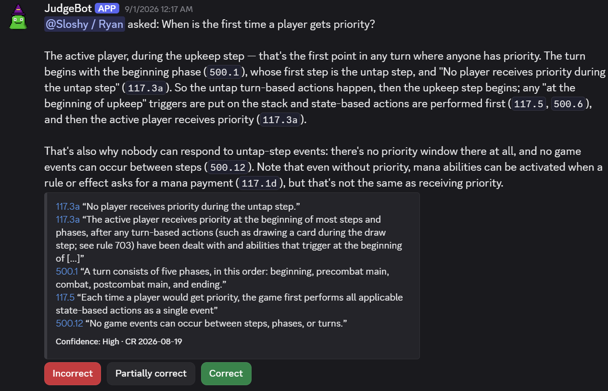

## `/judge question:`

Ask in plain language. Nicknames work ("bob", "goyf", "snappy", "t3feri"). The alias list
is `data/aliases.yaml` in the repository, and pull requests adding to it are welcome. Use
brackets like `[[Full Card Name]]` to avoid ambiguity. A bracketed name matches only the
card with that exact name (current or printed, including one face of a split or
double-faced card). Anything else in brackets, such as a nickname or a near miss, is
offered back as a choice rather than corrected. Answers take twenty to forty-five seconds.
The bot acknowledges at once and edits the reply in.

The reply opens with a non-pinging `@you asked:` header, then the ruling, then a citation
per line. Rule citations link to the rule on the Yawgatog mirror of the Comprehensive
Rules. Rulings and Oracle text link to the card on Scryfall. The footer names the cards
the question was resolved to, which lets you check that "bob" was taken to mean Dark
Confidant. It then gives the model's confidence and the CR version it answered from.

If a name could mean several cards ("Tibalt", "Emrakul") you get a **did you mean…?** row
of up to five buttons instead of a guess. Only the person who asked can pick. If a name
matches nothing, the reply says which and suggests `[[Full Card Name]]`. Tournament-policy and
price questions are declined after the cheap classification step, before the expensive
synthesis call.

Ask a follow-up in the same channel and the bot sees the recent question-and-answer pairs
from that channel as history, so "what if it had flash?" works.

Each member can ask a limited number of questions per window (six per ten minutes unless
the operator changed `JUDGE_USER_LIMIT`). Past it, the bot says how long is left, and only
the asker sees that. A "busy" reply does not count, and anything after it does,
answered or not. Picking a card from a "did you mean…?" row does not count again, and
`/card` and `/rule` are never limited.

### `private: True`

`/judge question: … private: True` shows the answer to you alone, as Discord's "Only you
can see this" message. A private answer stands by itself:

- It reads no channel history, so it cannot be a follow-up, and nothing can follow it up.
- It is not saved to the database, so it has no rating buttons and never becomes an
  example for a later question. It is still sent to the model provider and leaves the
  same log lines as any question.
- "Did you mean…?" still works, privately.

Discord fixes who sees a reply when the bot acknowledges the command, so a private answer
cannot be made public afterwards. Ask again without the option.

## `/card name:` and `/rule id:`

Lookups from the bot's database. They call no model, cost nothing and answer at once.

- `/card` takes a name or nickname, resolved as `/judge` resolves it, and shows every
  face's mana cost, type line and current Oracle text, then the card's rulings, newest
  first. The title links to the card on Scryfall. A name that could mean several cards
  lists them instead of guessing.
- `/rule` takes a rule number: `702.19` (the rule with its sub-rules and examples),
  `702.19b` (one sub-rule) or `702` (the section, as many whole rules as fit). The title
  links to the rule on the Yawgatog mirror, and the footer is the CR version. A rule
  longer than an embed is cut, with a note to ask for one sub-rule.

Both post in the channel. Add `private: True` to see the result alone.

## Rating buttons

Every answer has three buttons: **Incorrect**, **Partially correct**, **Correct**. Rating
again replaces your earlier rating. A rating changes one thing: which past answers are
shown to the model as *examples* when a similar question comes in. Scores are smoothed (a
Bayesian mean with a prior of "partially correct" and a weight of three votes), so one
early vote cannot swing an answer's standing. Answers rated below 1.5 with at least five
votes are excluded.

After an **Incorrect** rating, the confirmation (which only you see) names the operator
to tell about a wrong ruling. When the instance's source is on GitHub, it also links that
repository's *Wrong or unhelpful ruling* issue form.

Members holding the server's judge role (`JUDGE_ROLE`, default `Judge`) rate with an
override. The most recent judge rating replaces the crowd's score for that answer. The
rules always outrank examples. Prior answers are rendered after the CR material and labeled
with their rating, and the model is told they are precedent, not authority.

A past answer is retired automatically when its citations stop holding against the
current rules, rulings or Oracle text (a new CR release, an erratum). It comes back if
the text is restored.

## `/help`

Two replies: what the bot does, how to ask and what it stores, then the same notice as
`/license` (where the source is and who runs this instance). Both are ephemeral, so only
you see them.

## `/license`

The source offer: the repository holding this instance's source code, the commit it was
built from (linked into the repository), the licence (AGPL-3.0-or-later) and the
copyright. An operator running a modified version points it at their fork with
`JUDGE_SOURCE_URL`. An unmodified build names the upstream repository. The reply ends
with the Discord username of whoever runs this instance (`JUDGE_OPERATOR_DISCORD`, which
the bot does not start without) and their support address if they set one. The reply is
ephemeral.

## `/forget`

Deletes every rating you have recorded and tells you how many there were. Ratings are the
only data tied to your user id. Questions are stored against the channel, not the asker.
